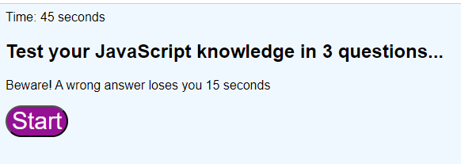
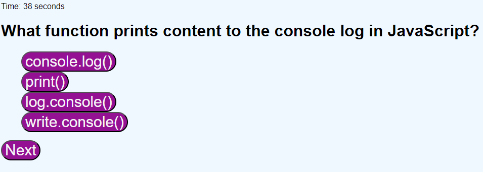
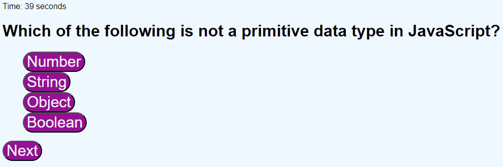

# 04-javascript_quiz
Web APIs Challenge: Code Quiz

**User Story**

The USER wants to challenge their knowledge of Javascript by taking a short quiz and keeping track of scores to compare with peers

**Acceptance Criteria**

THE USER is presented with a start container describing the quiz and rules

WHEN the USER clicks  

THEN the timer begins at 45 seconds and USER is presented with the first question

IF the USER chooses right a message displays **"Correct!"**

IF the USER chooses wrong a message displays **"Incorrect"** and 15 seconds is deducted from the timer 

WHEN the USER clicks  the USER is presented with the next question

](assets/images/question2-javascriptquiz.png)

IF the user fails to click next within 5 seconds the USER will automatically be presented with the next question

IF the timer runs out a message will display "You Lose! Times up!" and the game is over and you are prompted to submit your initials to log score 0

WHEN all the questions are answered the quiz is over

THEN the USER is prompted to enter maximum 3 initials

WHEN the USER clicks  the USER initials and Score that equals the time left will be logged

THEN the **Top 10 scores** will be displayed

AND the USER will also be presented with  to clear the high scores

IF the USER clicks  the High Scores will reset

WHEN the High Scores container appears the USER will also be presented with  to restart the Quiz

IF the USER clicks  the start container will appear again and hide the high scores container and two buttons

WHEN the quiz restarts and the USER clicks the  button again the timer will start back at 45 seconds

**References**

References made to our school lessons **Module 4** and help with the Javascript structure by Tutor **David Elutilo**

Build A Quiz App With JavaScript-Reference-[Web Dev Simplified-Youtube Video](https://www.youtube.com/watch?v=riDzcEQbX6k)
 
 clear alert function reference-
[stackoverflow.com](https://stackoverflow.com/questions/34341462/element-declared-as-variable-vs-get-element?rq=3)

highscore to local storage reference-
[stackoverflow.com](https://stackoverflow.com/questions/29370017/adding-a-high-score-to-local-storage)

input form reference-
[w3schools.com](https://www.w3schools.com/html/tryit.asp?filename=tryhtml_form_submit)

preventing default behaviour reference-
[wesbos.com](https://wesbos.com/javascript/05-events/prevent-default-and-form-events)
